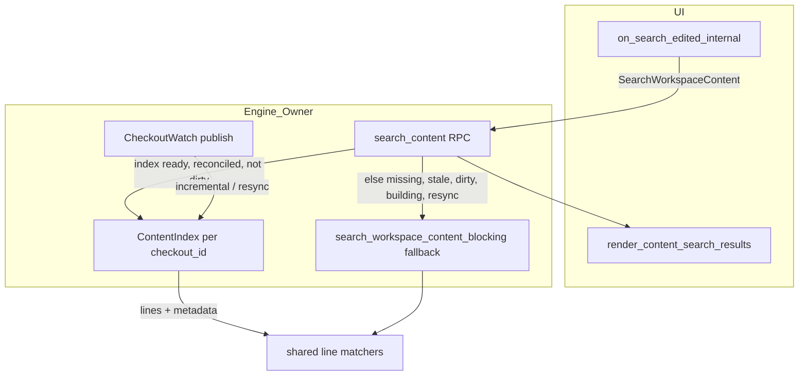

# Plan: Zerona workspace content search — background index

Status: **IMPLEMENTATION IN PROGRESS** (engine + UI Stage 0–2; indexed reads gated; benchmark harness env-gated).  
Parent: [`plan-zeron-content-search.md`](plan-zeron-content-search.md) (on-demand scan shipped; this plan adds **warm indexing** for faster **repeated** searches).  
Repo: `/root/zeron` (Zerona fork).

## Summary

Today every `SearchWorkspaceContent` RPC performs a bounded full-workspace walk and re-reads file bytes on the **owning engine**. That matches correctness goals but repeats I/O and CPU on every query. This plan adds a **per-checkout, device-local SQLite line cache** (persistent text store, not a candidate-narrowing search index) built in the background, with incremental updates from the same filesystem watch pipeline the explorer already uses, and **safe fallback** to the existing scanner when the cache is missing, unreconciled, dirty, building, resyncing, or over budget. **Indexed reads are gated** until invalidation/freshness are implemented. The UI must **clear prior hits immediately** when a new contents query starts (including the 200 ms debounce), keep **generation guards** against stale RPC replies, show an **indeterminate spinner** through the unary RPC, and separate **loading vs empty vs error** (no fabricated in-flight progress on the unary response).

---

## Goals

| Goal | Notes |
|------|--------|
| Faster repeated contents search | Warm index avoids re-walking and re-reading unchanged files. |
| Language-agnostic text | Index UTF-8 lines with existing line/binary/UTF-8 rules; no syntax-aware tokenization. |
| Incremental freshness | Edits, renames, deletes, ignore-toggle semantics, watch overflow/repair resync. |
| Safe fallback | Same matchers and caps as current scanner when fallback runs; parity defined on exhaustive fixtures (see [Semantic preservation](#semantic-preservation)). |
| Low-resource VPS | Default caps for 1 vCPU / low RAM; idle-friendly background work. |
| Remote compatibility | Index on **owner** only; unary RPC + `targetDeviceId` unchanged. |
| UX clarity | Replace stale results with loading/progress immediately; protect latest request. |

## Non-goals (this phase)

- Filename search changes (`SEARCH_WORKSPACE_FILES` stays as-is).
- Regex query mode (not implemented today; see [Semantic preservation](#semantic-preservation)).
- Client-side index on viewer devices for remote workspaces.
- Streaming/partial result RPC (still single response, 200 cap).
- Proving concrete speedup numbers in this document (benchmark **method** and **proposal** thresholds only — not measured results).
- In-flight search progress over unary `SearchWorkspaceContent` (requires separate status/poll or event protocol; see [UI](#ui-loading-progress-and-stale-result-guards)).

---

## Verified current state (path:line)

### Engine — on-demand scanner (source of truth for semantics)

| Topic | Location |
|-------|----------|
| Module entry, budgets, walk + ignore | `crates/engine/src/workspace_content_search.rs:25-88` (`CONTENT_SEARCH_*`, `WalkBuilder`, `.git` prune, `follow_links(false)`) |
| Cancel + scan budget | `crates/engine/src/workspace_content_search.rs:63-117`, `108-111`, `195-198` |
| Per-file caps, binary tail, UTF-8 | `crates/engine/src/workspace_content_search.rs:283-419` |
| Literal case folding | `crates/engine/src/workspace_content_search.rs:495-548` |
| Fuzzy (nucleo `AtomKind::Fuzzy`) | `crates/engine/src/workspace_content_search.rs:564-619` |
| RPC worker + cancel on drop | `crates/engine/src/workspace_files.rs:435-461`, `1050-1067` |
| Query validation (non-empty, ≤256 chars) | `crates/engine/src/workspace_files.rs:1301-1312` |
| RPC dispatch + 6 s timeout | `crates/engine/src/rpc.rs:3090-3099`, `WORKSPACE_FILE_RPC_TIMEOUT` at `workspace_files.rs:39` |
| Forwardable to owning device | `crates/engine/src/rpc.rs:1443`, `4037` |
| Integration tests | `crates/engine/tests/workspace_files.rs:110-139`, `crates/engine/tests/device_routing.rs:1893-1905` |

### Engine — workspace lifecycle & watch (index hook points)

| Topic | Location |
|-------|----------|
| `WorkspaceFiles` construction | `crates/engine/src/lib.rs:262-263`, `workspace_files.rs:243-255` |
| Per-checkout `CheckoutWatch` | `workspace_files.rs:70-80`, `582-626`, `652-717` |
| Notify debounce / overflow / repair resync | `workspace_files.rs:42-45`, `820-902` |
| Watch dir budget (8k dirs) | `workspace_files.rs:45`, `1030-1047` |
| Shutdown cancels watches | `workspace_files.rs:628-648`, `lib.rs:535` |

### Protocol & client

| Topic | Location |
|-------|----------|
| Request/response types | `crates/proto/src/entities.rs:560-631` |
| RPC name | `crates/rpc/src/lib.rs` (`SEARCH_WORKSPACE_CONTENT`) |
| UI transport | `crates/ui/src/files/client.rs:183-188`, `286-294` |

### UI — search state (gaps called out in [UI plan](#ui-loading-progress-and-stale-result-guards))

| Topic | Location |
|-------|----------|
| Debounce 200 ms, `generation` guard | `crates/ui/src/files/search.rs:361-446`, `307-310`, `1177-1187` |
| `loading` set true on edit; **results not cleared** on non-empty query change | `crates/ui/src/files/search.rs:369-407` vs `777-788` (empty results + `loading` ⇒ “Searching…”; **non-empty results stay visible during debounce and in-flight RPC**) |
| Contents empty vs loading copy | `crates/ui/src/files/search.rs:782-787` |
| Completion / incomplete banners | `crates/ui/src/files/search.rs:1012-1028` |
| Explorer watch subscription | `crates/ui/src/files/watch.rs:9-72`, started from `mod.rs:953-972` |
| Target change resets search | `crates/ui/src/files/mod.rs:1235-1283` |
| Stale navigation after open | `crates/ui/src/files/preview.rs:704-738` |

### Storage precedent (SQLite on engine)

- Workspace `Cargo.toml` pins `rusqlite` with **`bundled`** (`/root/zeron/Cargo.toml:123`); `zeron-engine` already depends on it (`crates/engine/Cargo.toml:22`). **Do not assume a system SQLite install** for dev/CI; bundled satisfies engine binaries. CI may still omit UI OpenSSL (see parent plan UI check failure).

---

## Problem statement

1. **Repeated queries** pay full walk + read cost — parent verification: **`search_workspace_content_blocking` runs on every `search_content` RPC** today (`workspace_files.rs:448-456`); no warm path exists yet.  
2. **UI** can show **previous query’s hits** while a new query is debouncing or loading (`search.rs` does not clear `content_results` on line 369-407).  
3. **No measurable progress** surface for long scans; only post-hoc `files_scanned` in the response.  
4. **Watch pipeline** already detects changes but does not feed content search.

---

## Design options (2–4) and tradeoffs

### Option A — SQLite FTS5 / trigram (inverted index)

- **Idea:** Store token/trigram index per checkout; **literal-only** queries may use FTS `MATCH` as a **optional** prefilter after separate parity validation. **Do not** use trigram/FTS to narrow fuzzy candidates: nucleo fuzzy matching is subsequence-style, not token/trigram overlap — trigram narrowing is **not generally sound** and can cause **false negatives** (missed hits).
- **Pros:** Possible literal narrowing on very large repos; persistent across restarts; aligns with existing `rusqlite` + `DocsStore` patterns (`crates/sync/src/store.rs:1-77`).
- **Cons:** FTS tokenization is **not** identical to `literal_fold_units` without careful custom tokenizers; migration + corruption handling; extra disk; warmup CPU to tokenize; fuzzy must still run line-level nucleo on **all** indexed lines (or full fallback), not on trigram subsets.
- **VPS fit:** Moderate RAM if mmap + bounded connection cache; build must be throttled. **Adopt only if** Option B benchmark gate fails on latency **and** literal-only trigram prefilter passes its own exhaustive parity gate.

### Option B — SQLite line table (persistent text cache, not a narrowing index)

- **Idea:** Background walk stores one row per line (or chunked lines) plus file metadata. This is a **persistent on-disk text cache** of lines the scanner would read — **not** an inverted index for candidate narrowing. Search still iterates lines (from DB or disk) using **the same** `process_line` / matcher code as the scanner.
- **Pros:** Matcher parity by construction; language-agnostic; incremental row delete/insert on watch; literal + fuzzy share one path; avoids unsound trigram prefilter for fuzzy.
- **Cons:** Repeated queries still examine **all indexed lines** (same algorithmic work as scan, different I/O path); SQLite page cache may be **slower than a warm OS buffer cache** serving repeated `read()` on unchanged files; needs tight **row/byte caps** and honest benchmarking before adoption.
- **VPS fit:** **Candidate** architecture — **not** default-on until [benchmark go/no-go](#benchmark-gate-for-option-b-proposals-not-results) passes. Throttle batch inserts; always retain fallback scanner.

### Option C — In-memory only file text cache (no SQLite)

- **Idea:** `HashMap<path, Vec<String>>` warmed on first search or background task.
- **Pros:** Minimal code; fast repeated reads.
- **Cons:** RAM blows up on monorepos; lost on engine restart; poor fit for **1 vCPU low-RAM VPS** unless tiny workspaces.
- **VPS fit:** Poor default; optional L2 for hot files only.

### Option D — Keep scan; add **read-through block cache** only

- **Idea:** Cache file bytes keyed by `(path, mtime, size)` during a single scan; reuse across queries until invalidation.
- **Pros:** Smallest diff; no watch coupling strictly required.
- **Cons:** Still **directory walk every query**; limited win; cache invalidation easy to get wrong.
- **VPS fit:** Acceptable **Stage 0** micro-optimization only, not the main goal.

### Recommendation (1 vCPU / low-RAM VPS)

**Plan around Option B (SQLite line store)** as the main optimization hypothesis, with **mandatory benchmark go/no-go** before enabling indexed reads in production. If the gate **fails** (indexed path not faster and/or not lower resource use than fallback on target hardware), **stay on the current scanner** (and optional Stage 0 micro-cache per Option D) rather than shipping a slower path.

**Option A (trigram/FTS)** is **fallback/alternative** only for **literal** prefilter after exhaustive parity tests — never for fuzzy candidate narrowing.

Rationale:

- Correctness: reuse extracted line scanner + matchers (`workspace_content_search.rs`) on cache-backed lines; fallback calls existing `search_workspace_content_blocking` unchanged until indexed read rollout criteria are met.
- Honest performance: line store removes repeated **disk** reads and directory walks when fresh; it does **not** reduce line-matching CPU vs a full scan. Warm OS cache may beat cold SQLite for read-heavy small repos — measure, do not assume.
- Resource control: cap indexed bytes/files; **global** disk budget includes `.sqlite`, `-wal`, `-shm`; background indexer yields and shares one global worker (see [Bounded CPU](#bounded-cpu--memory--storage--cancellation)).
- Dependencies: **tentative** — reuse workspace `rusqlite` bundled; no new crates until a gated trigram literal phase.

**Index directory (tentative):** `{EngineProfile::store_root()}/content-index/{checkout_id}.sqlite` (device-local, not in the workspace tree). Key `checkout_id` from `resolve_target` (`workspace_files.rs:367-376`).

---

## Architecture (high level)



### Index contents (conceptual schema)

- **`meta`:** schema version, indexer generation, ignore profile fingerprint (`include_ignored` is **per search**, not stored — see below).
- **`file`:** wire path, mtime, size, content hash (optional), `skipped_binary`, `skipped_too_large`, `skipped_unsupported`, indexed byte length.
- **`line`:** `file_id`, `line_no`, `text` (valid UTF-8 only; same caps as scanner).

**Two logical index profiles per checkout:** `respect_gitignore` vs `include_all` (mirror `WalkBuilder::standard_filters` behavior in `workspace_content_search.rs:82-84`). Toggle in UI (`tree.include_ignored()`) selects profile at query time; switching profiles may require **background build** or on-the-fly fallback until warm.

### Warmup lifecycle

| Phase | Behavior |
|-------|----------|
| **Cold** | No DB or version mismatch → **fallback scanner only** for reads; background build may run but **must not** serve queries until freshness stages ship. |
| **Building** | Low-priority work under **global** indexer cap; cooperative cancel on shutdown / checkout evicted. Queries use **fallback** while building. |
| **Ready (reads gated)** | `search_content` may read lines from DB **only after** incremental invalidation, resync, and freshness contract are implemented **and** checkout epoch is clean (not dirty/resyncing). Still applies **global** `CONTENT_SEARCH_MAX_TOTAL_BYTES_SCANNED` and **deadline** over bytes examined (same counter semantics as today). |
| **Degraded / dirty** | Watch gap, overflow, failed incremental apply, or epoch bump → mark **dirty**; **fallback** until incremental or full resync completes. No “best effort” indexed reads on dirty data. |
| **Evicted** | LRU when **total** index disk (all checkouts, all profiles, **including** `-wal` / `-shm`) > global cap or checkout unused TTL. |

### Consistency & freshness (conservative contract)

**No absolute snapshot guarantee:** The index is a **best-effort cache** synchronized with the filesystem via watch + periodic reconciliation. Queries may observe data that lagged a bounded window behind the live tree; when freshness cannot be proven, **fallback scanner** wins.

**Startup:** A persisted on-disk DB is **not trusted** until **reconciliation** (walk or stat sample per policy) completes for that checkout profile. Until then: fallback reads, background reconcile/build.

**Dirty-before-update:** Mark paths (or checkout epoch) **dirty** before applying incremental row changes; readers that would use affected paths fall back until the update transaction commits and epoch is cleared.

**Epochs:** Per-checkout (per profile) **generation/epoch** increments on resync, ignore-profile fingerprint change, schema migration, or full rebuild. Search progress denominators and “known file counts” must come from the **same epoch** as the active search — never assume counts from the last completed walk if epoch changed mid-query.

| Event | Action |
|-------|--------|
| File modified | Mark dirty → re-index file if under cap; else set skip flags matching scanner. **mtime+size alone is insufficient** (see below). |
| Created | Dirty → insert after walk rules; watch may arrive after debounce. |
| Removed | Delete `file` + `line` rows; dirty if delete races with in-flight read. |
| Renamed | Transaction: delete old path, index new path (`watch.rs:158-175`). |
| Watch overflow/repair (`publish(true, …)`) | **needs_full_resync** + epoch bump; fallback until resync completes. |
| `include_ignored` toggle | Select index profile; fallback + enqueue build if profile cold or dirty. |
| Ignore rules change (.gitignore edits) | Resync + epoch bump (mtime-only insufficient). |
| Symlinks | `follow_links(false)` — consistent with walk. |
| Binary / invalid UTF-8 | Same skip counters as response metadata. |

**mtime + size limitations:** Equal **mtime and size** does not detect same-length in-place edits or some toolchain writes. **New files** can be missed briefly due to `WATCH_DEBOUNCE` and coalesced events. Mitigation: optional **content hash** (or full re-read) for **affected files only** on incremental update — **never** hash every file on each query.

**TOCTOU at query time:** If stored metadata disagrees with live `metadata_for_workspace_file`, or path is dirty / epoch mismatched → per-file fallback scan or whole-query fallback per policy; do not serve stale lines from DB.

---

## Semantic preservation (must not regress)

| Rule | Current behavior | Index obligation |
|------|------------------|------------------|
| Literal case | Per-char fold first `to_lowercase()` char (`workspace_content_search.rs:501-548`) | Run **same** `literal_ranges` on indexed line text |
| Fuzzy | nucleo `Pattern::new` + `AtomKind::Fuzzy`, `Normalization::Smart` (`564-579`) | Same matcher on indexed lines |
| Regex | **Not supported** (only Literal + Fuzzy in proto) | N/A; do not add unless product scope changes |
| Short queries | Validated non-empty (`1301-1305`) | Unchanged |
| Result limit | 200 (`MAX_SEARCH_RESULTS`) | Unchanged |
| Per-line / preview / highlight caps | `CONTENT_SEARCH_MAX_*` | Unchanged |
| Ignored files | `include_ignored` on walk | Separate index profiles |
| Symlinks | No follow (`81`) | Same |
| Binary | NUL tail rules (`332-415`) | Store flags; don’t index past NUL |
| Unicode | UTF-8 lines; scalar columns in match (`635-641`) | Index only valid UTF-8 lines |
| Sort order | `sort_matches` (`770+`) | Same sort on combined results |
| Remote | Owner executes search (`device_routing` test) | Index exists only on owner FS |

**Parity scope (do not over-claim):**

- **Exhaustive fixtures:** For repos small enough that `MAX_SEARCH_RESULTS`, per-file caps, and `CONTENT_SEARCH_MAX_TOTAL_BYTES_SCANNED` are **not** hit, indexed path and fallback must return **identical** `SearchWorkspaceContentResponse` (order + fields) for literal + fuzzy, both ignore profiles, binary/UTF-8 edge cases.
- **Capped / budget-truncated searches:** Full byte-identical responses are **not** justified when traversal stops early — order depends on walk/iteration order and may differ between DB iteration and filesystem walk. Define acceptance as: **same matchers and caps**, **unchanged** existing response limits (`MAX_SEARCH_RESULTS`, scan budgets), and **truthful** `completion` / `incomplete_reason` / skip counters — not identical match lists when truncation is nondeterministic.
- **Traversal order:** Document expected order for indexed iteration (e.g. wire path lexicographic, line number ascending) and assert capped searches match that **specified** order in tests, or require exhaustive fixtures for strict equality.

---

## Bounded CPU / memory / storage / cancellation

| Knob | Starting proposal | Enforce |
|------|-------------------|---------|
| Index disk **global** | 256 MiB soft cap **across all checkouts and profiles** (tunable) | LRU evict checkout DBs; count **`.sqlite` + `-wal` + `-shm`** |
| Indexed file size | `CONTENT_SEARCH_MAX_BYTES_PER_FILE` (`workspace_content_search.rs:25`) | Skip row, set `skipped_too_large` |
| Line length | `CONTENT_SEARCH_MAX_LINE_BYTES` (`27`) | Skip line indexing |
| Background CPU | 25 % duty cycle or 10 ms sleep every N files | `tokio::select!` + cancel token |
| Indexing parallelism | **One global** indexing worker / concurrency cap for the **entire engine** (all checkouts) on 1 vCPU — **not** one active indexer per checkout | Foreground `search_content` (fallback or indexed) **preempts** or pauses background indexing |
| Search cancel | Existing `AtomicBool` + `CancelOnDrop` (`workspace_files.rs:443-460`) | Index iteration checks cancel; outcome matches **current** path: `Err(WorkspaceFilesError::Io("workspace content search cancelled"))` (`workspace_content_search.rs:108-111`, `195-198`) — **not** `ScanIncomplete` with a cancelled reason |
| RPC timeout | 6 s (`workspace_files.rs:39`) | Stop cursor; `ScanIncomplete` + budget reason where applicable; cancel path as above |
| SQLite RAM | `cache_size` negative pragma small (e.g. 8 MiB) | Set on open |

---

## Remote owner-side placement & protocol compatibility

- **Placement:** Index DB on the device that owns `ResolvedWorkspace.root` (`workspace_files.rs:90-93`, authorization at `342-345`). Viewer sends the same `SearchWorkspaceContentRequest` + `targetDeviceId` (`client.rs:313-327`).
- **Protocol:** **Stage 1** — no proto change; behavior transparent. **Optional future** — `GetWorkspaceContentIndexStatus` (or similar) for **index warmup/build** stats only. **Unary response fields on `SearchWorkspaceContentResponse` cannot deliver in-flight search progress** (single response after RPC completes). True live search progress requires an explicit **status poll or event protocol** keyed by `(search_id, generation)` with owner forwarding for remote workspaces — out of scope unless added as a versioned RPC; do not imply progress via optional fields on the unary response alone.
- **Unknown method** path stays (`search.rs:341-348`).

---

## UI: loading, progress, and stale-result guards

### Required behavior (explicit user requirement)

1. On **any** new contents query (including each debounced keystroke): **immediately** clear `content_results`, reset result list height, clear completion banners, set phase **Debouncing** then **Searching**.  
2. **`generation`** + `accepts` (`307-310`, `441-446`) remain authoritative for RPC completion.  
3. Distinguish: **Loading** (spinner / message), **No matches** (loading false, empty vec, no error), **Error** (`search_state.error`), **Partial** (existing `ScanIncomplete` / `ResultLimitReached` banners).  
4. **Default UX:** **Indeterminate spinner** from first edit through debounce and until the unary RPC returns — this is the **required** Stage 0/1 behavior without new protocols.  
5. **Measurable in-search progress** (optional future): only via dedicated poll/event API with `(search_id, generation)`; owner must forward for remote. **Do not** attach faux progress to unary response fields.  
6. **Index warmup vs search:** Stats from `GetWorkspaceContentIndexStatus` (files indexed, build phase) describe **background cache warmup**, not current query progress — separate UI copy if shown.  
7. **Denominators:** `files_examined / total` style text only when `total` is from the **same checkout epoch/generation** as the active search; **never** reuse “last walk” counts after resync, epoch bump, or mid-search invalidation.

### Suggested `FileSearchState` fields (implementation phase)

- `content_phase: ContentSearchPhase` (`Idle | Debouncing | Searching | Done`) — measurable sub-state **only** when poll API exists.  
- Clear `content_results` in `on_search_edited_internal` when `kind == Contents` and query non-empty (before spawn).  
- `render_content_search_results`: if `loading || content_phase == Debouncing` **or** `content_results.is_empty()` while searching → loading UI, not “No content matches”.  
- Optional: poll index **warmup** status during long background builds — distinct from search spinner.

---

## Numbered insertion points (implementation checklist)

1. **`crates/engine/src/lib.rs:262-263`** — Construct `ContentIndexManager` alongside `WorkspaceFiles::new`; pass into `WorkspaceFiles` or shared `Arc`.  
2. **`crates/engine/src/workspace_files.rs:243-255`** — Hold `HashMap<checkout_id, Arc<ContentIndex>>` + eviction policy.  
3. **`crates/engine/src/workspace_files.rs:435-461` (`search_content`)** — Branch: indexed read vs `search_workspace_content_blocking` (fallback default until Stage 3 gate); preserve cancel + timeout; no in-RPC progress callback unless separate poll API exists.  
4. **`crates/engine/src/workspace_content_search.rs`** — Extract `match_lines_in_source` used by scanner and index iterator (minimal move, no semantic change).  
5. **`crates/engine/src/workspace_files.rs:582-626` (`watch_files`)** — On new `CheckoutWatch`, register index listener for that `checkout_id` + `root`.  
6. **`crates/engine/src/workspace_files.rs:746-760` (`CheckoutWatch::publish`)** — Fan-out to index incremental updater (debounced similarly to `WATCH_DEBOUNCE`).  
7. **`crates/engine/src/workspace_files.rs:628-648` (`shutdown`)** — Cancel all index builders and close DBs.  
8. **`crates/ui/src/files/mod.rs:953-972` (`ensure_loaded`)** — After `ensure_watch`, optionally notify engine to prioritize index warmup (if status RPC exists).  
9. **`crates/ui/src/files/search.rs:361-495`** — Clear results + phases on new query; spinner through RPC; optional warmup status poll only.  
10. **`crates/ui/src/files/search.rs:777-815`** — Render loading vs empty vs results list.  
11. **`crates/proto/src/entities.rs:621-631`** — Optional index **warmup** status only if needed; no unary in-flight search progress.  
12. **Tests:** `crates/engine/tests/workspace_files.rs`, `device_routing.rs` — parity + remote forward; new `content_index.rs` unit tests.

---

## Staged rollout

**Ordering rule:** **Do not enable indexed reads** until **incremental invalidation, resync, and freshness** (dirty epochs, startup reconciliation, watch-driven updates) are implemented and tested. Background build may run earlier, but **`search_content` keeps calling the scanner** until the read gate opens.

| Stage | Deliverable | User-visible |
|-------|-------------|--------------|
| **0** | UI-only: clear results on new query; debouncing state; indeterminate spinner through RPC; tests in `search.rs` | Fixed stale hits; honest loading |
| **1** | Background index **writer** only (persist line cache); **all queries still use fallback scanner**; global worker + disk cap | Same search results/latency as today; optional background disk |
| **2** | Incremental watch updates + resync + startup reconciliation + dirty/epoch contract + per-file hash on **affected** paths only | Cache stays aligned; still fallback reads until Stage 3 |
| **3** | Indexed search when `Ready` **and** not dirty/resyncing; exhaustive parity tests; benchmark go/no-go | Faster repeat search **if** gate passes |
| **4** (optional) | FTS/trigram **literal-only** prefilter | Only if Stage 3 gate fails on CPU **and** literal trigram passes exhaustive parity; **never** for fuzzy narrowing |

Rollout default: **flag off** until Stage 3 parity + benchmark gate pass in CI on target profile.

---

## Verification & benchmarks (no invented speed claims)

### Benchmark gate for Option B (proposals — not results)

All thresholds below are **go/no-go proposals** for the target VPS profile (1 vCPU, low RAM). Record actual numbers in PR/bench logs; **do not** treat these as measured outcomes in this plan.

| Criterion | Proposal threshold (go) | Proposal threshold (no-go) |
|-----------|-------------------------|----------------------------|
| **Warm repeat latency** | Median wall time for fixed query Q ×5 with index read enabled ≤ **0.7×** median warm fallback (OS cache hot) on same fixture | Median ≥ fallback or within **±10%** noise band |
| **Cold first query** | Indexed path does not regress p95 vs fallback by more than **+15%** while index is building (fallback only until Stage 3) | Material regression on user-visible first search |
| **Idle indexing CPU** | Sustained indexer CPU **< 25%** of one core while no foreground search | Sustained **> 40%** without active search |
| **Disk budget** | Total index files (incl. WAL/shm) stay under global cap with LRU | Chronic cap pressure on typical checkout |
| **RAM** | No OOM; SQLite pragmas keep engine RSS within existing VPS envelope | RSS growth forces swap thrash |

**If no-go:** Keep `ZERONA_CONTENT_INDEX` read path off; retain scanner-only; consider Option D micro-cache only or gated Option A **literal** trigram — not fuzzy narrowing.

### Automated (existing commands — from parent plan)

```bash
export PATH="$HOME/.cargo/bin:$PATH"
CARGO_BUILD_JOBS=1 CARGO_PROFILE_DEV_DEBUG=0 CARGO_PROFILE_TEST_DEBUG=0 \
  cargo test --locked -p zeron-engine --lib workspace_content_search::
CARGO_BUILD_JOBS=1 CARGO_PROFILE_DEV_DEBUG=0 CARGO_PROFILE_TEST_DEBUG=0 \
  cargo test --locked -p zeron-engine --test workspace_files
CARGO_BUILD_JOBS=1 CARGO_PROFILE_DEV_DEBUG=0 CARGO_PROFILE_TEST_DEBUG=0 \
  cargo test --locked -p zeron-engine --test device_routing
```

Add (implementation phase):

- `cargo test --locked -p zeron-engine content_index` — parity matrix vs fallback.  
- UI: `cargo test --locked -p zeron-ui files::search` (when OpenSSL CI packages available per `.github/actions/linux-ci/action.yml`).

### Manual / bench harness (record numbers in PR, not here)

Use a **fixed fixture repo** (e.g. copy of this workspace or scripted tree) on the target VPS:

| Scenario | Procedure | Record |
|----------|-----------|--------|
| **Cold** | Delete index DB; first search query Q | `time` or `/usr/bin/time -v` wall time; `files_scanned` from response |
| **Warm** | Wait until index `Ready`; repeat Q ×5 | min/median wall time |
| **Repeated** | Same Q without workspace change | Compare fallback vs indexed (flag on/off) |
| **Changed** | Touch one file mid-index; search | Correct hits + `ScanIncomplete` or stale flags as designed |

Store logs under e.g. `docs/plan/bench-logs/` or PR description — **do not** assert % improvements in this plan.

### Acceptance criteria

- [ ] Parity: indexed ≡ fallback on **exhaustive** golden fixtures (no budget/result cap hit) for literal + fuzzy, binary tail, ignored toggle (both profiles when built).  
- [ ] Capped searches: documented traversal order or exhaustive-only equality; truthful limits and diagnostics.  
- [ ] Freshness: dirty/resync/building → fallback; startup DB reconciled before indexed reads; epoch-safe counts if progress API added later.  
- [ ] Remote: `SEARCH_WORKSPACE_CONTENT` still forwarded (`device_routing.rs:1893-1905`).  
- [ ] Cancel: dropping RPC sets cancel; `WorkspaceFilesError::Io("workspace content search cancelled")` — same as today.  
- [ ] UI: new query never shows previous query hits during debounce/RPC; generation drops stale responses; spinner until RPC completes.  
- [ ] UI: empty vs loading vs error distinct; no fake in-search progress on unary RPC.  
- [ ] Resource: **one global** indexer; foreground priority; disk cap incl. WAL/shm; shutdown cancels builders.  
- [ ] Benchmark gate: recorded results vs proposal table; read path enabled only on **go**.  
- [ ] Rollback: flag off restores scan-only `search_workspace_content_blocking` every RPC.

### Rollback

1. Set feature flag off (or ship revert).  
2. Optional: delete `{store_root}/content-index/*.sqlite` to reclaim disk.  
3. No proto breakage if optional warmup-status RPC/fields use serde defaults.

---

## Dependencies (tentative)

| Dependency | Status in repo | Plan |
|------------|----------------|------|
| `rusqlite` bundled | In workspace + `zeron-engine` | Reuse for line store |
| `ignore` | Scanner walk | Reuse for indexer walk |
| `nucleo-matcher` | Fuzzy | Unchanged |
| SQLite FTS5 | Not used yet | Phase 4 only if needed |
| New crates (`tantivy`, etc.) | Not present | **Avoid** unless Option B fails benchmarks |

---

## Risks

| Risk | Mitigation |
|------|------------|
| Semantic drift index vs scan | Single matcher module; exhaustive parity; fallback on dirty/mismatch |
| Line cache slower than OS cache | Benchmark gate; stay on scanner if no-go |
| False negatives from trigram fuzzy narrow | **Forbidden** — fuzzy scans all lines or fallback |
| mtime+size / watch debounce staleness | Dirty epochs; reconciliation; per-file hash on incremental; fallback |
| RAM on large repos | Byte caps; line table limits; global eviction |
| `include_ignored` doubles index work | Two profiles; lazy build second profile |
| Watch gaps | `resync_required` → full rebuild + fallback reads |
| Indexer storms on 1 vCPU | Global single worker; foreground priority |
| Dual path maintenance | Keep fallback forever; index is optional optimization |
| UI OpenSSL blocks `zeron-ui` CI locally | Engine tests gate index; UI Stage 0 tests when CI available |

---

## Blocking user choices

**None required for planning.** Defaults:

- Option B line store **hypothesis**; bundled SQLite; index under `store_root`; feature flag default **off** until Stage 3 exhaustive parity **and** benchmark **go**.  
- Optional FTS trigram **literal-only** if gate fails and separate parity passes — not for fuzzy candidate narrowing.

---

## Parent plan cross-reference

Implementation status and scanner bugfix history remain in [`plan-zeron-content-search.md`](plan-zeron-content-search.md). This document does **not** change that scope; it layers indexing + UI loading behavior on top.

---

## Implementation status (measured on VPS 2026-10-10)

| Item | Status | Evidence |
|------|--------|----------|
| UI: clear results + debouncing/spinner phases | **Implemented** | `crates/ui/src/files/search.rs` (`begin_content_search_query`, `mini_glyph_spinner`) |
| Option B line-store writer + blocking worker thread | **Implemented** | `crates/engine/src/workspace_content_index.rs` (`index_worker_blocking`, `ForegroundSearchGuard`) |
| Writer/reads env gates (`ZERONA_CONTENT_INDEX`, `ZERONA_CONTENT_INDEX_WRITE`) | **Implemented** | `content_index_reads_enabled()`, `content_index_writer_enabled()`, `parse_content_index_env_flag()` |
| Watch raw dirty (notify callback) + debounced incremental | **Implemented** | `on_raw_fs_activity` in notify callback; bounded coalesced index work queue; per-profile incremental revisions |
| Indexed read gate (default off) + revision checks | **Implemented** | `can_serve_indexed_read`, post-query revision guard |
| Parity / revision tests | **Run** | `cargo test -p zeron-engine --test content_index` (4 passed, 2026-10-10) |
| Scanner unit tests | **Run** | `cargo test -p zeron-engine --lib workspace_content_search::` (16 passed) |
| Benchmark harness | **Env-gated** | `ZERONA_CONTENT_INDEX_BENCH=1` |
| CI gate | **Added** | `.github/workflows/voice-tests.yml` (`content_index` test target) |
| UI `files::search` compile/tests on VPS | **Not executed** | Full `zeron-ui` native build not run in this pass (GPUI/OpenSSL deps) |
| Benchmark go/no-go | **Re-bench required** | Prior ratio≈0.995 used **cargo target tree** fixture (invalid). Harness now builds **1000-file synthetic corpus** under scratch `tempdir_in` when available; re-run `ZERONA_CONTENT_INDEX_BENCH=1` for real numbers — indexed reads remain **off** until go |

Default: **`ZERONA_CONTENT_INDEX` unset → scanner-only reads and no background writer** (use `ZERONA_CONTENT_INDEX_WRITE=1` only for bench/local warmup).

## Files modified (implementation)

| File | Action |
|------|--------|
| `docs/plan/plan-zerona-content-search-index.md` | Plan + status |
| `crates/engine/src/workspace_content_index.rs` | **New** |
| `crates/engine/src/workspace_content_search.rs` | Shared matchers / line collect |
| `crates/engine/src/workspace_files.rs` | Hooks + `search_content` branch |
| `crates/engine/src/lib.rs` | Manager wiring |
| `crates/engine/tests/content_index.rs` | **New** |
| `crates/ui/src/files/search.rs` | Stage 0 UX |
| `.github/workflows/voice-tests.yml` | CI |

---

## Changelog (this amendment)

1. **Option B** reframed as persistent **text cache** (not narrowing index); may lose to warm OS cache; **benchmark go/no-go** before read path; removed unsound DB-size vs trigram claim.  
2. **Option A / trigram:** literal-only optional; **fuzzy trigram narrowing rejected** (subsequence / false negatives).  
3. **Unary RPC:** in-flight search progress = spinner only; live progress needs poll/event + `search_id`/`generation`; warmup stats ≠ search progress; epoch-grounded counts.  
4. **Rollout reordered:** incremental invalidation + reconciliation **before** indexed reads; startup DB untrusted until reconciled; expanded freshness contract (dirty-first, epochs, no snapshot guarantee, hash affected files only).  
5. **Resources:** **global** indexer cap and disk budget (WAL/shm); foreground priority.  
6. **Parity:** exhaustive fixtures for identity; capped searches use truthful limits/diagnostics; cancellation matches current **Io error** path.  
7. **Benchmark table:** proposal thresholds labeled proposals, not results.
